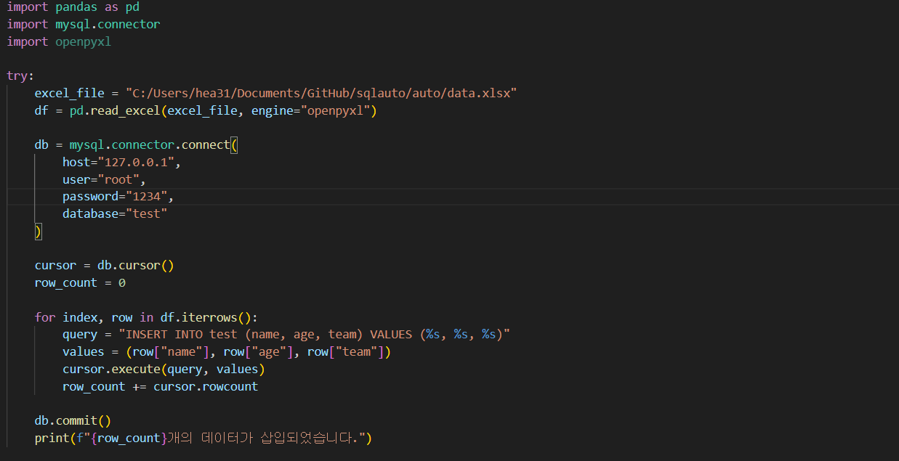

# Python Pandas 라이브러리를 이용한 sql insert문 자동화 + 여기에 사용할 excel 만들기

## 필수 라이브러리!!! pandas openpyxl mysql-connector
pip install pandas openpyxl mysql-connector
pip3 install pandas openpyxl mysql-connector

### 엑셀 생성

#### 위에서 만든 엑셀파일을 insert하기

이런식으로 db에 데이터가 들어간다

### 만약 db 연결이 안되면 pip install mysql-connector-python==8.0.31 or pip3 install mysql-connector-python==8.0.31 !!
버전이 안맞아서 안되는걸수도있음
